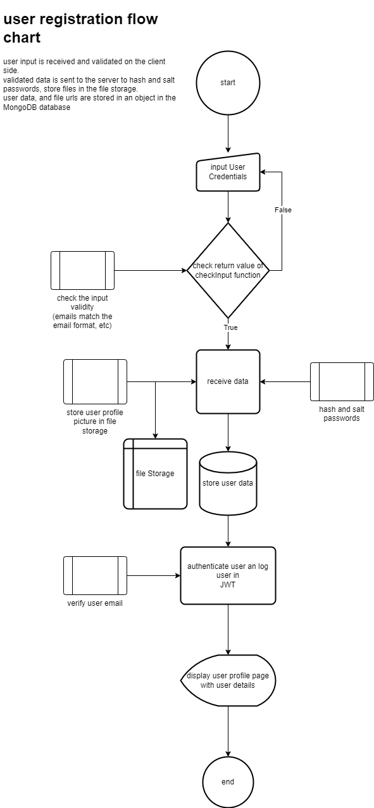
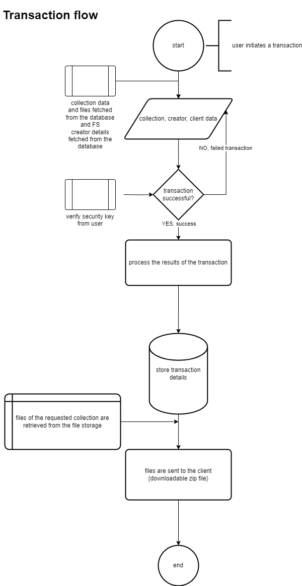
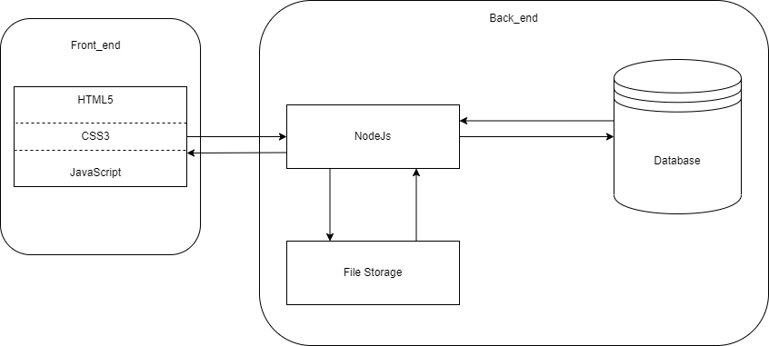
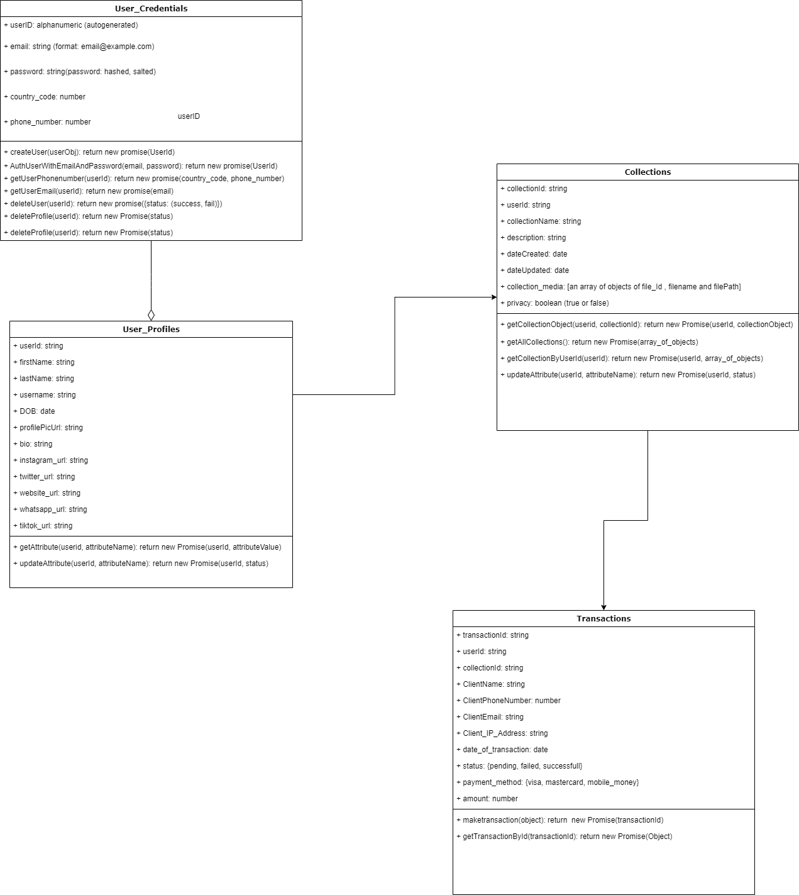
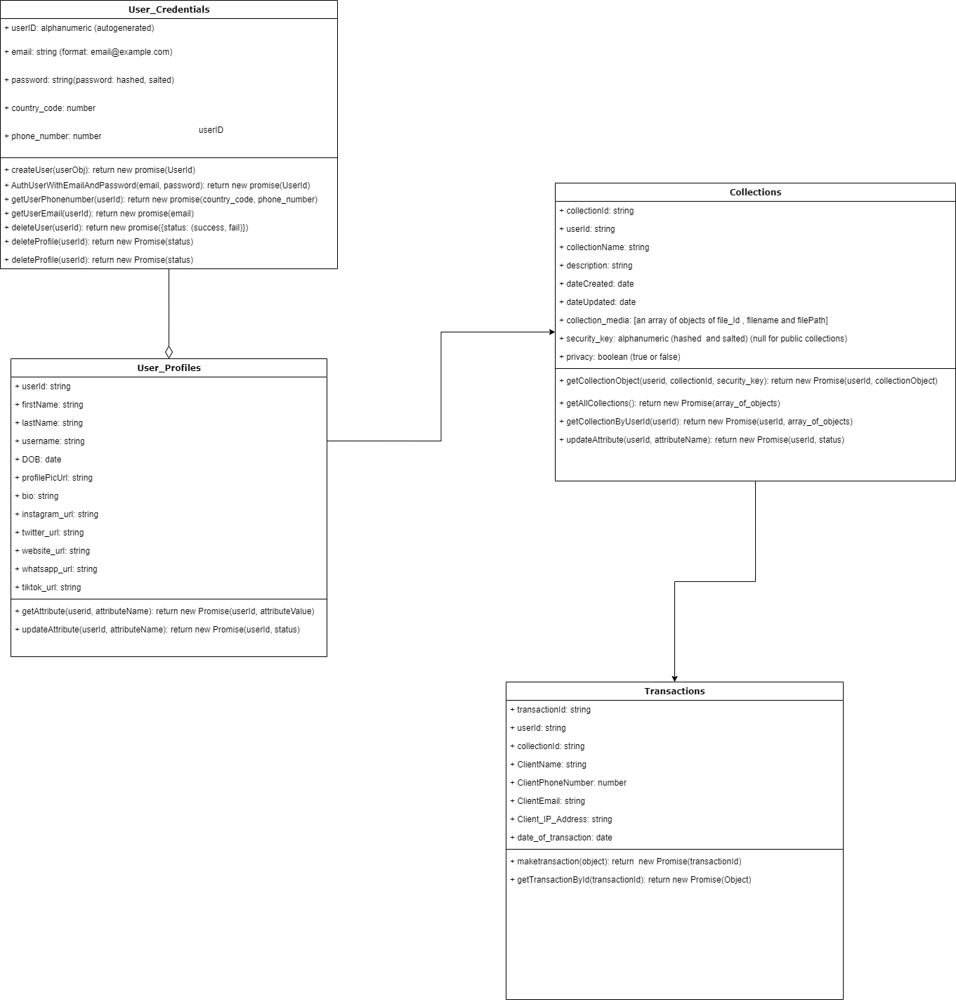

# ClearCapture

## ___Introduction___
* The project, ClearCapture, is a audio/visual file sharing platform dedicated to providing secure and lossless file transmission from service providers to clients.
* The service providers in question range from Photographers/Videographers, Graphic Designers or other content creators.
* It supports payment, allows for creators to  advertise their work, and allows for a safe and secure system for creators when transacting with clients.
* This project was developed using HTML5 CSS3 and JavaScript(ES6) for front-end, nodeJS for the back-end, MongoDB for database, MulterJS for handling FS, and Vercel for hosting services.

## ___Problem Statement:___
* The project ClearCapture, addresses the problem of the lack of a secure and user-friendly interface that allows for lossless file transfer and an avenue for creators to showcase their work.
* Existing platforms lack the necessary features and level of security which small  scale content creators need in order to be able to showcase their work to their audience and make simpler and secure transactions with their clients.

## ___Project Scope.___
* The scope of ClearCapture project encompasses:
    * User Registration
	* File Uploads and Downloads
	* Product Listing and Previews
	* Product Ratings and Reviews
	* File Compression

## ___Architecture And Design:___
* ClearCapture project follows a three-tier architecture with a front-end, back-end and a database.
* It uses a non-Relational database( MongoDB) that offers scalability, high performance, reliability, and flexibility, to store contents and user data.
* The user interface is designed to be intuitive and responsive using HTML CSS and JavaScript.
* The back-end uses nodeJS which offers seamless integration of third party APIs and packages.
* The project uses Vercel Hobby for hosting, integrating Vercel cli tools for easy build and deployment.

## ___Implementation:___
* This project follows the agile methodology, with two-week sprints and regular code reviews.
* It adheres to the ESLint coding standard for JavaScript and used Git and GitHub for version control.

## ___Testing And Quality Assurance.___
* The ClearCapture project will undergo rigorous testing, including unit testing, integration testing, responsiveness of the application and user acceptance testing using Jest.

## ___Deployment and Maintenance___
* The ClearCapture project will be deployed on a cloud server using Vercel Hobby build, deployment and hosting service.
* The platform will be maintained and regular updates through security patches and feature updates will be served to provide stability of the platform.

## ___Conclusion:___
* In conclusion, the ClearCapture project will address the need for a secure and user-friendly lossless file sharing platform for enthusiasts. 
* It has gained positive feedback from surveys and has positioned to grow based on user requirements.

## ___References:___
* HTML, CSS, JavaScript( for front-end web Development)
* NodeJS(back-end / server-side development)
* MongoDB(non relational database)
* MulterJS(FS manager)
* Vercel Hobby(cloud Service provider)

## ___diagrams___

